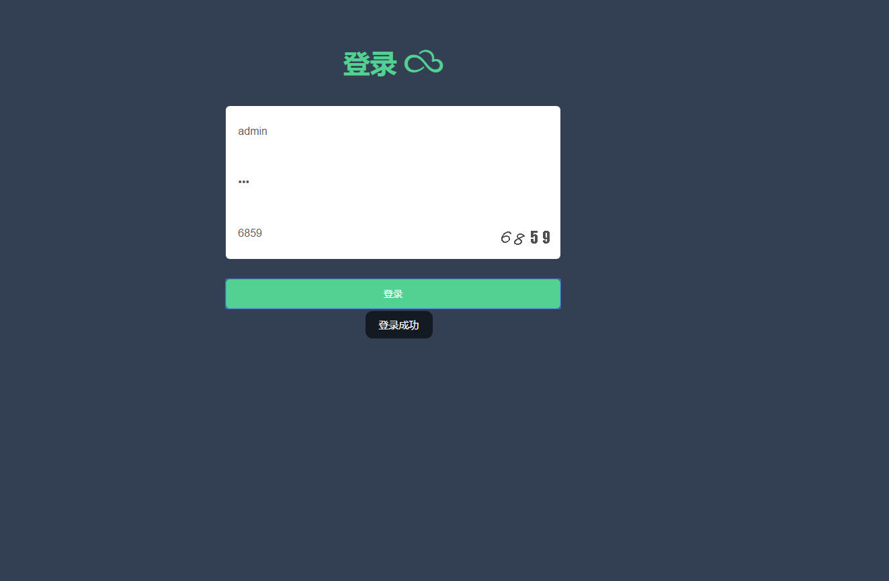
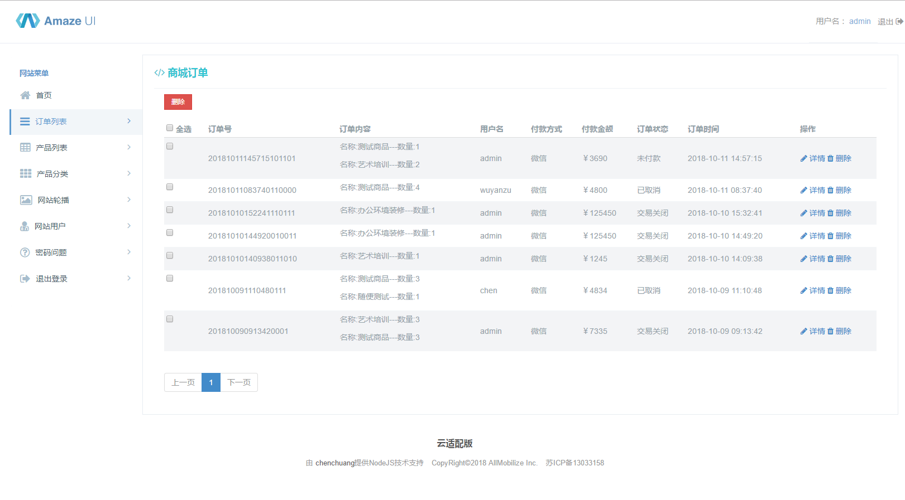
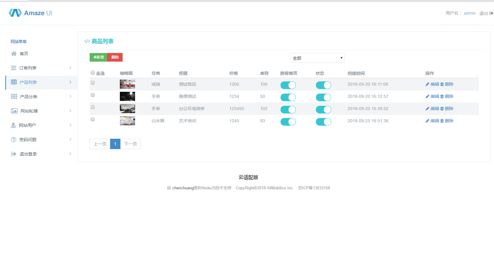
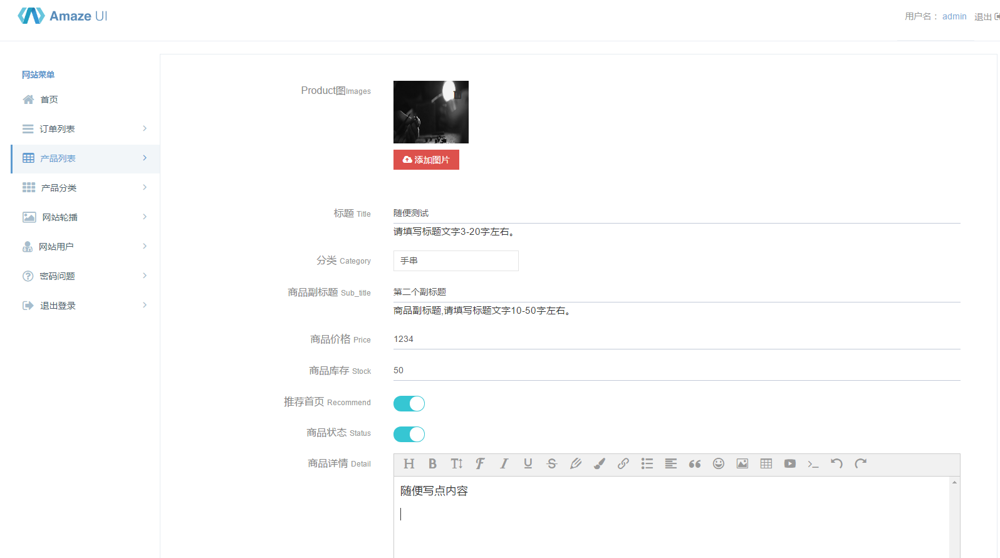
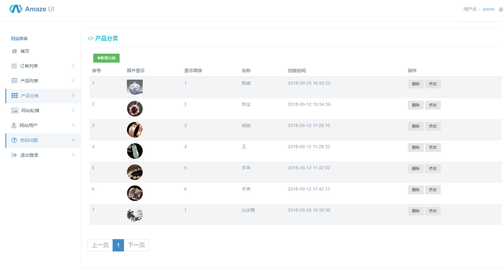
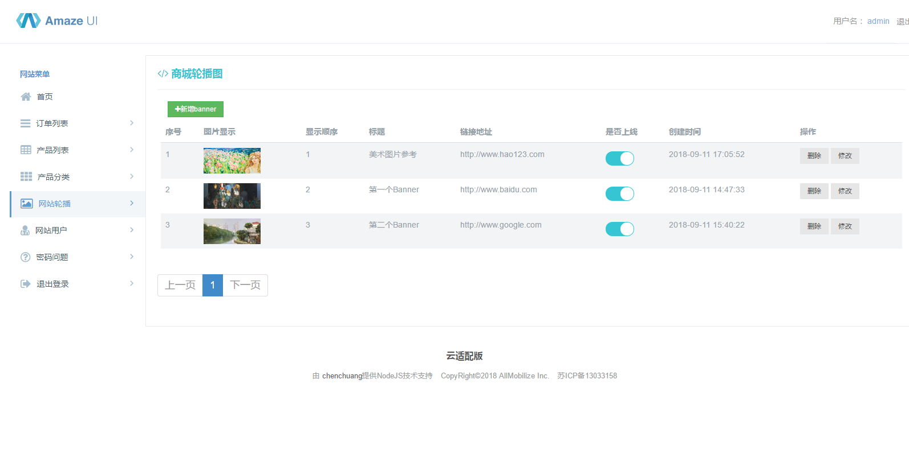
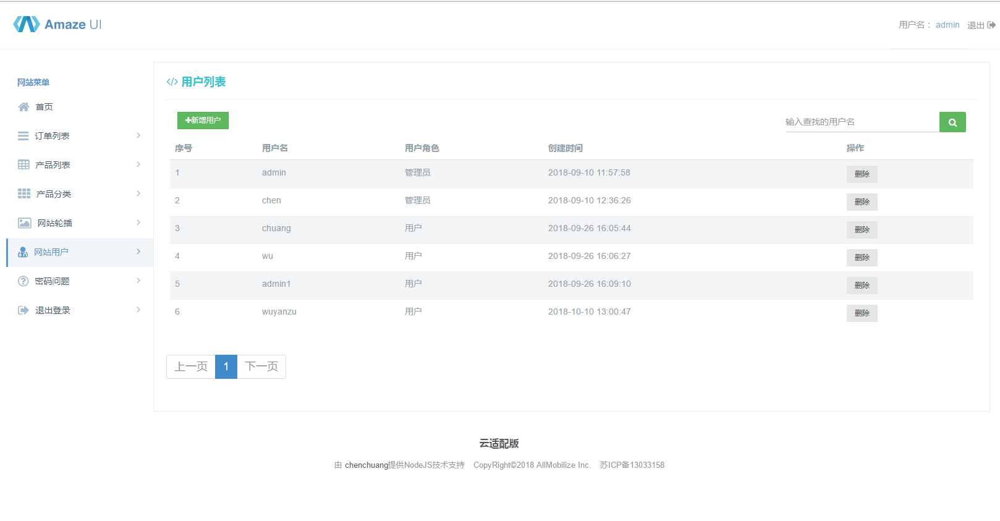

# NodeJS Mall项目

# Node做的简约商城（部分功能没有）  

> vue项目地址 https://github.com/benchenchuang/myMall

## 登录（用户名+密码+验证码）
  
## 订单中心（查看所有订单+删除订单）
  
## 商品列表（添加、查看、修改、删除等操作）
  
## 商品详情（查看、修改等操作）
  
## 产品分类（查看、添加、删除、修改等操作）
  
## 轮播图（查看、添加、删除、修改等操作）
  
## 用户（查看、添加、删除等操作）
  
 

### days_01 初始化项目及数据表结构
> koa2初始化项目及初始配置信息 
> 数据表框架构思及表设计 

### days_02 后台用户的添加  删除搜索等
> 后台用户管理相关的操作 

### days_03 找回密码问题的添加 删除 修改等
> 用户找回密码的问题相关操作 

### days_04 轮播模块
> 后台关于轮播模块的增删改查的操作 

### days_05 商品分类模块
> 后台关于商品分类模块的增删改查的操作 

### days_06 商品上传 修改等
> 后台关于商品的增删改查的操作 

### days_07 Vue手机端首页Api
> 关于手机首页内容的api合并 

### days_08 Vue手机端 商品列表和详情Api
> 关于手机页面商品列表和详情一些操作的api 

### days_09 Vue手机端 购物车相关Api
> 关于手机页面商品购物车的操作的api 

### days_10 Vue手机端 个人中心相关Api
> 关于手机页面 个人中心的信息 收藏列表 地址等的api 

### days_10 Vue手机端 订单相关Api
> 关于手机页面 订单的展示 取消 倒计时等的api 

